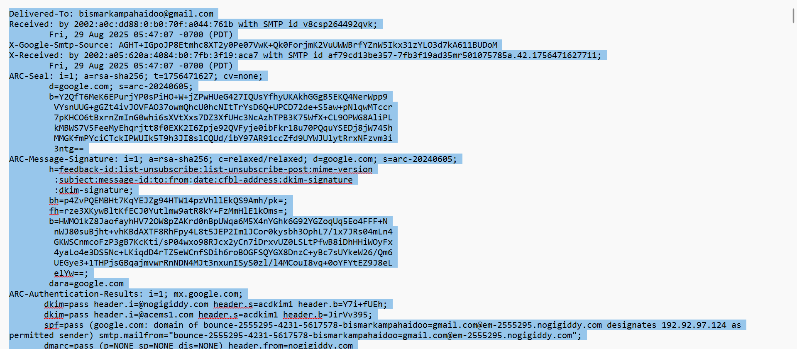

# Task 1: Email Analysis Report

## Objective
Analyze a sample email to identify potential security risks and red flags.

## Tool Used
- MXToolbox (https://mxtoolbox.com/)

## Steps Taken
1. Collected the sample email header.
2. Used MXToolbox to analyze SPF, DKIM, and DMARC records.
3. Checked if email passes authentication checks to identify phishing risks.

## Findings
- SPF, DKIM, and DMARC all passed.
- No suspicious or malicious activity detected.
- The email was properly authenticated, reducing the risk of spoofing.

## Screenshots

## Key Lessons
- Always verify SPF, DKIM, and DMARC to ensure email authenticity.
- Analyzing email headers can prevent phishing attacks.

