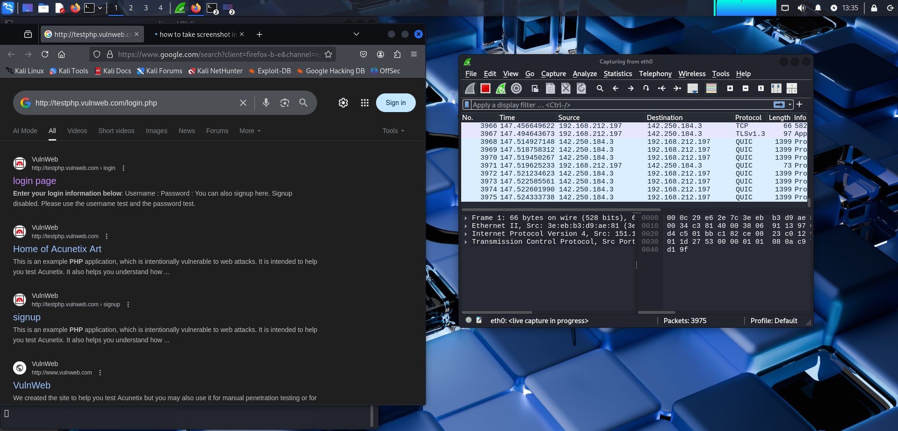
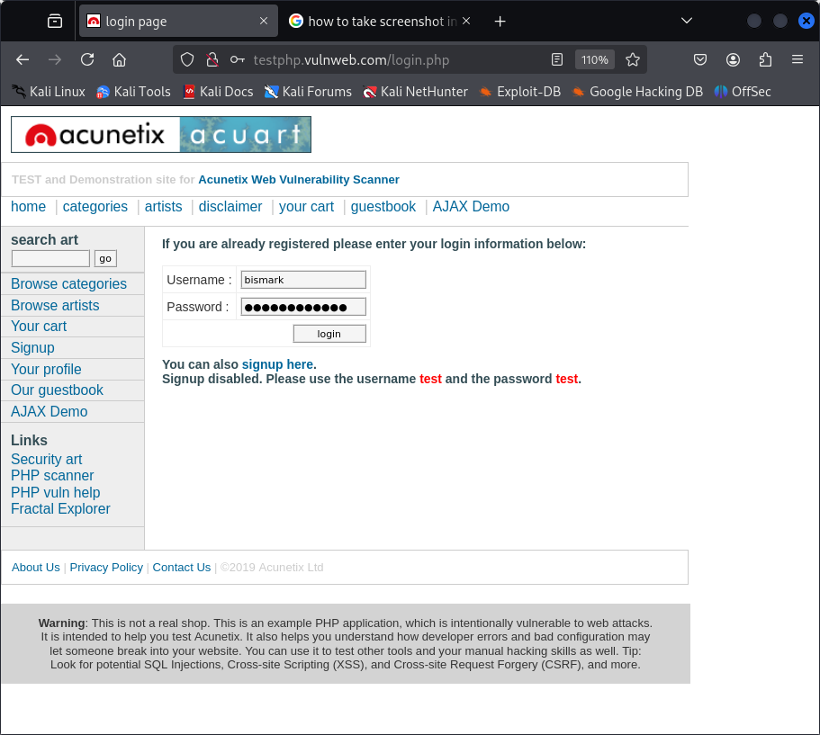
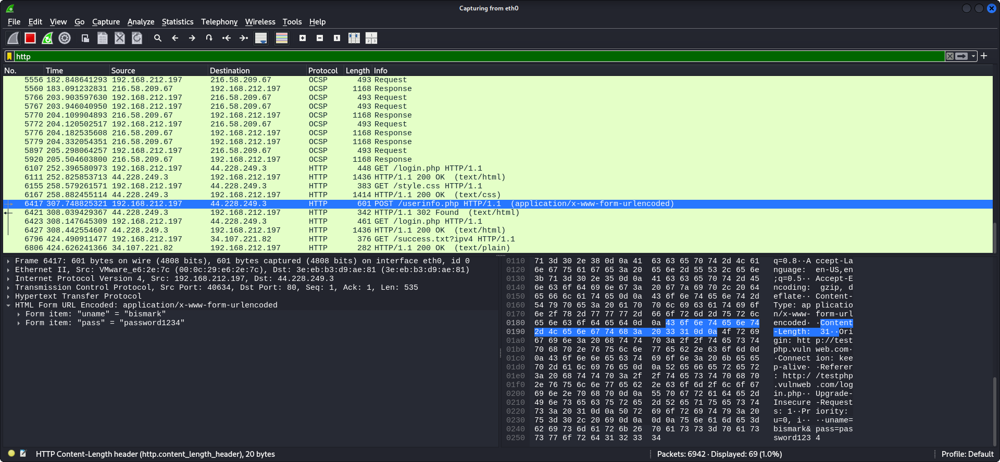

# Task 2: Sniffing Attack Using Wireshark

## Objective
Intercept and analyze network traffic to capture credentials from an HTTP site.

## Tool Used
- Wireshark (https://www.wireshark.org/)

## Target Site
- http://testphp.vulnweb.com/login.php

## Steps Taken
1. Started Wireshark and captured network packets while interacting with the target site.
2. Filtered packets using the HTTP protocol.
3. Identified login requests carrying credentials in plain text.

## Findings
- Successfully captured HTTP packets containing the username and password.
- Credentials were transmitted in plain text (no encryption or hashing).
- Highlighted the security risk of using HTTP instead of HTTPS.

## Screenshots

## Key Lessons
- Always use HTTPS to protect data in transit.
- Avoid transmitting sensitive information without encryption.
- Network monitoring can detect suspicious traffic early.

